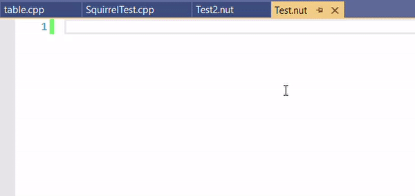
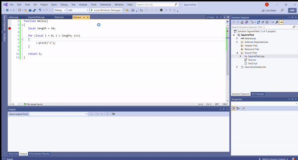

[Squirrel Language](http://squirrel-lang.org/) support for Visual Studio is developed and managed here.

## Features

Currently developing process is in progress but some features are already available

### Editor 

1. Syntax Coloring
2. Completion Suggesting
3. Error Squiggles
4. Snippets

### Debugger

1. Step In/Out/Over
2. Step into C++ code or step into Squirrel code
3. Merged callstacks (C++ and Squirrel)

## Build requiremenets

1. Microsoft Visual Studio 2019 or later
2. .NET Framework 4.5.2 or later

## Miscellaneous 

1. Currently only Squirrel 2.x version is supported for debugging. Later versions may work but not tested

## Work In Progress

1. Language features for editor (GoToDefinition/FindAllReferencets/etc.)
2. More smart indentation and syntax coloring
3. Print all operation results when stepping in debugger
4. Show local values' when hovering over while debugging
5. Reduce debugger overhead (currently it's around 30% of perfomance)

## Contributions

If you found a bug or want to provide this project with any feature I would gladly accept any help. Please leave an issue here or contact me in Telegram [@bu84ks](t.me/bu84ks)

## License

[License](https://github.com/Microsoft/VSLua/blob/master/license.txt)

This project has adopted the [Microsoft Open Source Code of Conduct](https://opensource.microsoft.com/codeofconduct/). For more information see the [Code of Conduct FAQ](https://opensource.microsoft.com/codeofconduct/faq/) or contact [opencode@microsoft.com](mailto:opencode@microsoft.com) with any additional questions or comments.
